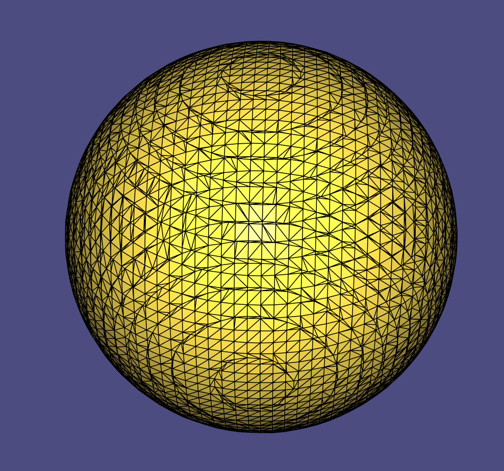

# Assignment 2
Name: Haitong Shi

Legi-Nr: 20960340

## Required results
Edit this 'README.md' file to report all your results. You only need to update the tables in the reports section by adding screenshots and reporting results.

### Tasks
1) Show the visualization of the constrained points for the 'cat.off' point cloud.

2) Show screenshots of the grid with nodes colored according to their implicit function values (cat.off and luigi.off).

3) Show screenshots of the reconstructed surfaces. Experiment with different parameter settings: grid resolution (also anisotropic in the 3 axes), Wendland function radius, polynomial degree. Add all these settings to the GUI to ease experimentation. Briefly summarize your observations and save the reconstructed models in the .off format for every point-cloud dataset provided (assignment2/results).

4) Theory question (1): Save your notes to assignment2/results and link to them from within the report.

5) Theory question (2): Save your notes to assignment2/results and link to them from within the report.

6) Show screenshots comparing the 'hound.off' computed with normal-based reconstruction to the point-based reconstruction of the previous task.

7) Compare your MLS reconstruction results to the surfaces obtained with RIMLS and Screened Poisson Reconstruction, and inspect the differences. Report your findings.

8) Show screenshorts of your method for estimating normals based on Principal Component Analysis. Compare the results with the reconstruction obtained using the provided normals.

## Reports
### 1 - Visualization of the 'cat.off' point cloud with constrained points
| model name  | view 01             | view 02            |
| :---------: | ------------------- | ------------------ |
| cat         ||  |

### 2 - Grid with nodes colored w.r.t. the implicit function (using the non-axis-aligned grid as described in Section 2.3) 
| model name  | view 01             | view 02            |
| :---------: | ------------------- | ------------------ |
| cat         ||  |
| luigi      ||  |

### 3 - Reconstructed surfaces
**Please also save the reconstructed shape (.off) in the results folder**

| sphere                                                     | cat                                                           |
| :--------------------------------------------------------: |  :----------------------------------------------------------: | 
||  |
| luigi                                                      | horse                                                         |
||  |
| hound                                                      |                                                               |
||                                                               |

**Please summarize your observations of what happens when you change the following parameters. Please feel free to add screenshots (by creating a separate table) to illustrate your explanation.**

| params                   | Your Observation    | 
| :---------------------:  | ------------------- |
| grid resolution          |   With larger resolution, the constructed meshes have more and smaller polygon as faces. Results for cat.off with resolution 20 and 40 are added. Wendlandradius is 90 and poly-degree is 0 in both cases. Also, there are more (and denser) grid points when increasing the resolution, causing more computation time.|
| Wendland function radius |   When we search neighbors for grid points, we only search for points that have distance less than Wendland function radius since we only need points with weight larger than 0. So with larger radius, we will find more neighbored points in general and need more time to compute. If the radius is too small, for some grid points, we will not find neighbored points. So the value will be assigned with large positive constant, causing holes in the mesh when we do marching cube. Results with radius 50 and 90 are added. Resolution is 40 and poly-degree is 0. |
| polynomial degree        |   The best visual results are got when the polynomial degree is 0 in our experiments. When increasing the polynomial degree, there are more noisy points around the surface, causing the constructed surface less smooth and some extra small meshes around the object. Results with different degrees of luigi.off are added. The resolution is 40 and radius is 4. |

| cat | |
| :---------------------:  | ------------------- |
| resolution = 20 | resolution = 40|
|| |
| Wendland function radius = 50 | Wendland function radius = 90|
|| |

| luigi | | |
| :---------------------:  | :-----------------: | :-----------------: |
|| | |

**Please compare the computation time for constraints computation and MLS using brute force and a spatial index. Use hound.off for the comparison and use the same parameters for the timings with and without use of spatial index (please report the parameters that you used).**
| step                    | brute force         |  spatial index      |
| :---------------------: | :-----------------: | :-----------------: |
| constraints             |   199.49s           |    8.77s            |
| MLS                     |   628.76s           |    99.79s           |

Parameters: grid resolution = 30, Wendland function radius = 0.05, polynomial degree = 0.

### 4 - Theory Question 1

**Prove that the normal of a surface defined by an implicit function is proportional to its gradient.**

Please show your answer in screenshot/photos (or link to a PDF). Make sure your answer is readable. You can add more pages by modifying the table.

| page1                   | 
| :---------------------: |
|  |

### 5 - Theory Question 2

**Compute the closed-form gradient of the MLS approximation.**

Please show your answer in screenshot/photos (or link to a PDF). Make sure your answer is readable. You can add more pages by modifying the table.

| page1                   | 
| :---------------------: |
|  |
|   |

### 6 - Normal-based v.s. point-based reconstruction ("hound.off")
| method       | view 01             | view 02            | comments           | 
| :---------:  | ------------------- | ------------------ | ------------------ |
| point-based  ||  | The results of two methods for degree = 0 is very similar. In this method, we require the implicit function to approximate some pre-defined values at constraind points. It may lead to undesirable surface oscillation. |
| normal-based ||  | In this method, we use the normal to define a linear function at constrained points instead of desired values. It is better in the ears of the hound and smoother when there is local hollows. |

### 7 - MLS v.s. Screened Poisson Reconstruction v.s. RIMLS

**No implementation required, you can use [Meshlab](https://www.meshlab.net) to perform the comparisons.**

| model names  | MLS          | Possion             | RIMLS               | 
| :---------:  | :---------:  | :-----------------: | :-----------------: |
| cat          ||  | |
| luigi        ||  | |
 
Comments : MLS results are less smooth than others. There are some noisy points. In poisson reconstruction, we explicitly fit a scalar function's gradient to the normal. There is no spurious sheets far from surface and it is robust to noise.
We can still see faces with polygon. In Robust Implicit MLS, we use an estimator to give less weight to outliers and use iterative method to solve the improved optimization problem. It is much smoothier that others, closer to original object surface.
Also, it is robust to noise and has better reconstruction of sharp features like the head and bottom of cat. 

### 8 - PCA normals v.s. provided normals (luigi.off)

| model names  | PCA normals             |  Provided normals       | 
| :---------:  | :---------------------: | :---------------------: |
| luigi        |  |  |

Comments :  The result with PCA normals is similar to that with provided normals, except that there are small amount of noisy points where the computed normals are not close enough to the provided ones. So on the top or between the legs, for example, the constructed surface is a bit worse than that with provided normals.
