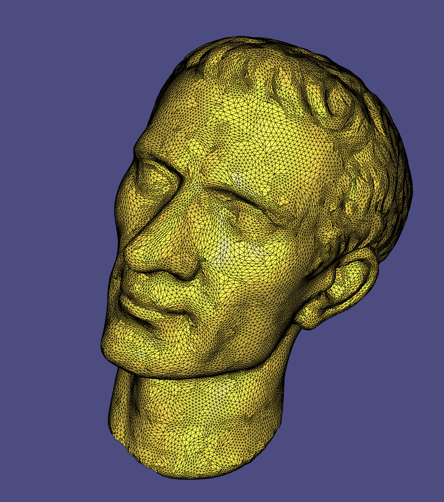
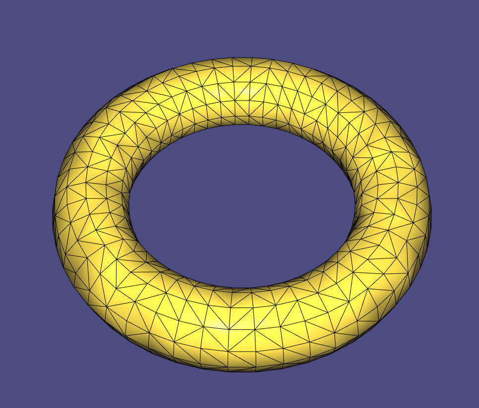
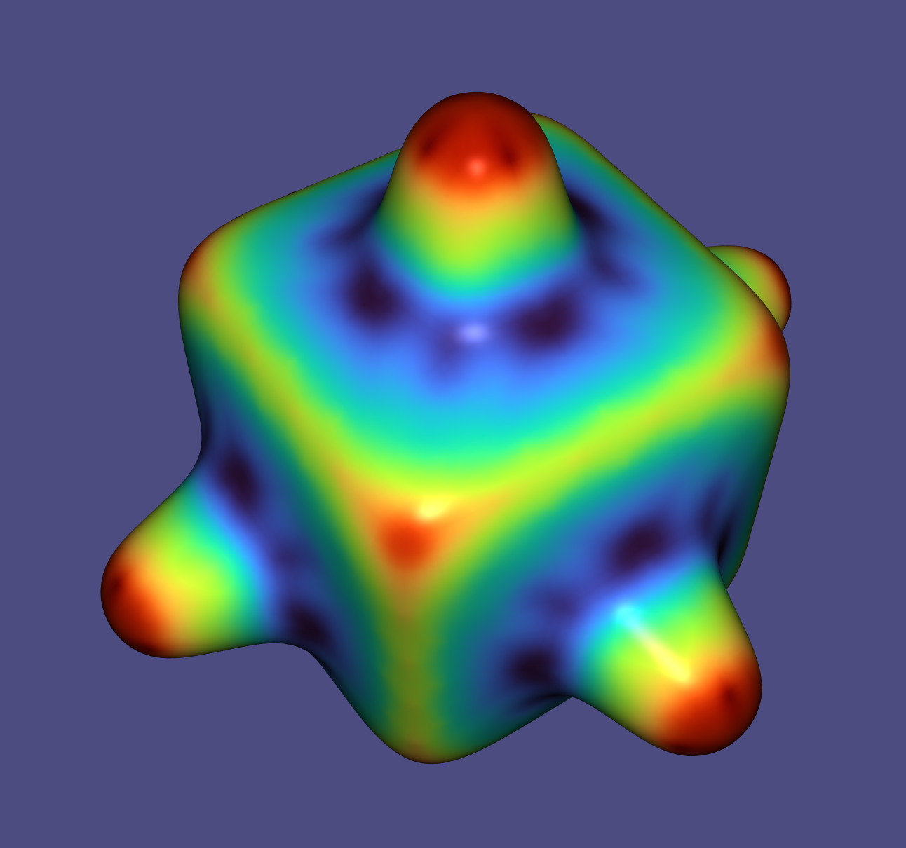

# Assignment 3

Name: Haitong Shi

Legi-Nr: 20960340

## Required results
Edit this 'README.md' file to report all your results. You only need to update the tables in the reports section by adding screenshots and reporting results.

### Mandatory Tasks
1) Show the screenshots of mesh **torus.obj** and the mesh **Julius.obj** from the data folder shaded with the 5 different normals. For the PCA and quadratic fitted normals show them each with both k=1 and k=2. Note that here k means k-ring neighbors.

2) Report your matching between curvature expressions and the figures. Provide a short motivation for your matchings.

3) Show screenshots of mesh **bumpy-cube.obj** from the data folder coloured according to the 4 discrete curvature measures.

4) Report your findings on the differences between implicit and explicit Laplacian smoothing, the differences between uniform vs cotangent weights and report the parameters you used and how changing them affects the result. Also show screenshots of both the implicit and explicit Laplacian smoothing results for mesh **bunny_noise.obj** from the data folder.

5) Report your findings on the comparison with results you obtained with the Laplacian smoothing vs with bilateral smoothing. Show screenshots of bilateral smoothing applied to mesh **bunny_noise.obj** from the data folder.

## Reports
### 1 - Shading w.r.t. different normals

**Use the mesh torus.obj and the mesh Julius.obj**

**Use the built-in function igl::per_vertex_normals() to orient your normals consistently**

| normals        | torus.obj                  | Julius.obj                 |
| :-----------:  | ------------------------------------- |------------------------------------- |
| standard       ||  |
| area-weighted  ||  |
| mean-curvature ||  |
| PCA (k=1)      ||  |
| PCA (k=2)      ||  |
| quadratic (k=1)||  |
| quadratic (k=2) ||  |

### 2 - Matching curvature expressions and the figures
| expression   |  Your answer |  Your explanation   |
|--------------|--------------|------------------|
| k1           | d      | k1 = s^2 + 1. The curvature is equal or larger than 1. Compare it with (a) and we can get the answer.         |
| k2           | c      | k2 = s, so k2 from -∞ to +∞. The curvature of left and right part in (c) is symmetrical but with different sign. |
| k3           | a      | k3 = s^2. The curvature is equal or larger than 0 and is most similar with (d). Compared with (d), the curvature will be 0 in the middle.      |
| k4           | b      | k4 = s^2 - 4. The curvature of (b) will be negative somewhere in the middle.   |

### 3 - Visualize curvatures

**Use the mesh bumpy-cube.obj**

| Min Curvature                         |  Max Curvature                       |
| ------------------------------------- |------------------------------------- |
||  |
| Mean Curvature                        |  Gaussian Curvature                  |
||  |

### 4 - Implicit v.s. explicit Laplacian Smoothing

**Use the mesh bunny_noise.obj**

**Try different laplacian matrices, step sizes and iterations**

| Input  |  Implicit (iteration = 1, step size = 0.001, cotangent weights)    |  Implicit (iteration = 1, step size = 0.01, cotangent weights)          | Implicit (iteration = 5, step size = 0.001, cotangent weights)          |
| -------|----------------------------- |------------------------------------|---------------------------------- |
||  | | |

Your observations: With larger step size or more iterations, the bunny can be over smoothed and lose original shape. Meshed can also shrink with too large parameters. In our case, smoothing with iteration 1, cotangent weights laplacian and step size 0.001 acheives better result. 

| Input  |  Explicit (iteration = 1, step size = 0.00001, cotangent weights)    |  Explicit (iteration = 1, step size = 0.00005, cotangent weights)          | Explicit (iteration = 30, step size = 0.0001, uniform weights)          |
| -------|----------------------------- |------------------------------------|---------------------------------- |
||  | | |

Your observations: Smoothing with cotangent weights laplacian generally achieves better smoothing result compared with uniform weight laplacian. In the case of explicit smoothing with cotangent weights, we need to choose parameters more carefully since the results can be like exploded (since we do multiplication each time) when we have large parameters. 
In our case, smoothing with iteration 1, cotangent weights laplacian and step size 0.00001 acheives better result. 

### 5 - Laplacian v.s. bilateral smoothing

**Use the mesh bunny_noise.obj**

| Input                                 |  Laplacian Smoothing                 |  Bilateral Smoothing                 |
| ------------------------------------- |------------------------------------- |------------------------------------- |
||  | |

Your observations: In bilateral smoothing, the change in shape and volume is minimal. The sharp features are more preserved. We use global parameters sigma_c and sigma_s for bilateral smoothing. Otherwise it is too slow to compute.
