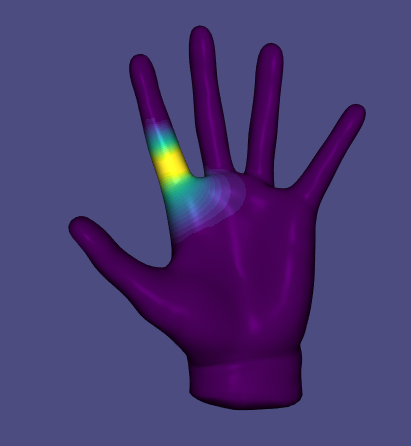

# Assignment 6: Skinning & Skeletal Animation

Name: 'Haitong Shi'

Legi-Nr: '20960340'


## Required results
Edit this 'README.md' file to report all your results. Use the ```/res``` folder to store your results.

### Tasks

1. Read Sec. 1 carefully to get familar with the data format, problem formulation, and mathematical background.
2. (Task 2) two theoretical discussions 
3. (Task 3) visualize the animation of the input skeleton of the hand shape from two types of rotations (rotation matrices and quaternions)
4. (Task 4) compute harmonic skinning weights on selected handles
5. (Task 5) per-vertex LBS + rotation/translation + Lerp
6. (Task 6) per-vertex LBS + dual quaternion + Nlerp
7. (Task 7) per-face LBS + quaternion + Slerp + Poisson Stitching
8. (Task 8.1) context-aware per-vertex LBS
9. (optional Task 8.2) context-aware per-face LBS
 
### Important Note
1. We do not provide template code for this assignment - feel free to use previous template code if you want
2. You can use any libigl functions (and other open-source code, but please add a reference in this case)
3. You are allowed to use your previous code (for example, you will find the Poisson Stitching technqiue quite similar to Deformation Transfer that you have implemented in Assignment 5; and also the provided handle selection in A5 might inspire you to design your handle selection tool in Task 4).
4. You are allowed to modify this report freely (but please try to stick to some table format of orangizing figures to avoid a 20-page long report)
5. Please feel free to try other skeletal animation/deformation data you can find online if you find the provided animation is not cool enough (for example [here](https://www.mixamo.com/#/), but note that they might be in different data format than the provide ones).
6. Please try to keep your code clean and self-explained (with necessary comments), since we will grade this assignment based on your code as well (~~please don't feel upset when you get bad animations, you can always blame our poor data preparation~~).

## Reports

### Task 2: Rotation Representation discussion
#### Task 2.1. compare different rotation representations

| Representions        |  Short Description  |     pros            |      cons           |
| :------------------: |:------------------: |:------------------: |:------------------: |
| rotation matrix      | Each rotation (in 3D) can be represented as a 3x3 matrix with real entries. Columns of rotation matrix are of unit length and are mutually orthogonal, and the determinant is 1.0. R^TR = I. The set of all such matrices forms the group SO(3) under the operation of matrix multiplication, and each member of the group in turn corresponds to a rotation. | Easy to compute partial derivatives. It can be extended to 4x4 to include position information as well as orientation, thus transforming both position and direction vectors using the matrix transform. | Use 9 numbers for parameterization but only have 3 degrees of freedom. To optimize or differentially control using this parameterization, we must impose six non-linear constraints to ensure the matrix remains in SO(3). Each step taken while integrating an ODE will require that each rotation be re-orthonormalized. |
| euler angles         | Three angles to describe the orientation w.r.t. a fixed coordinate system. An Euler angle is a DOF that represents a rotation about one of the coordinate axes. | Intuitive, only require three parameters, suitable for integrating ODEs, provide an easy to use interface to animators in the form of three independent sliders, work well in applications requiring one or two DOF rotations. | Rotation sequences matters, suffer from gimbal lock, when two of the three rotation axes align, causing a rotational DOF to be lost. Interpolation of Euler angles results in poor interpolation of rotations. |
| axis angle           | Parameterizes a rotation in a three-dimensional Euclidean space by two quantities: unit vector (direction of an axis rotation) + an angle (the magnitude of the rotation about the axis). | Intuitive, useful for converting between different representations of rigid body motion, such as homogeneous transformations and twists. | Don't support transformation composition. Have two singularities. |
| quaternions          | Quaternions are generally represented in the form q = a + bi + cj + dk where a, b, c, and d are real numbers, and i, j, and k are the basic quaternions. i^2 = j^2 = k^2 = ijk = -1. The quaternion q = [qx, qy, qz, qw]^T encodes a rotation of θ = 2cos^(-1)(qw) radians, about the unit axis v = (1 / sin(cos^(-1)(qw)))[qx, qy, qz]^T. Operations on quaternions, including scalar-product, quaternion product, norm, conjugate etc. are defined. | Avoid Gimbal lock, may be the best choice for interpolation of three DOF rotations, lead to numerically well-conditioned systems in the applications. | Less intuitive, incurs an overhead in efficiency and code complexity whenever derivatives are used for control or optimization. |

#### Task 2.2. Theoretical question for dual quaternions

| Euler angles -> rotation  matrix | 
| :------------------------------: |
|  | 

| rotation matrix -> quaternion |
| :------------------------------: |
|  |

| quaternion + translation -> dual quaternion  |
| :------------------------------: |
|  |

### Task 3: animation of the skeleton
| from rotaton matrix  |  from quaternions   |
| :------------------: |:------------------: |
| [From rotation matrix](./res/animation_rm.mov)  | [From quaternions](./res/animation_quat.mov) |

### Task 4: computing harmonic skinning weights on selected handles
#### Task 4.1. handle selection
| shape name           |  joint 1            |  joint 2            |  joint 3            |
| :------------------: |:------------------: |:------------------: |:------------------: |
| hand |   |  |  |


#### Task 4.2. skinning weights visualization
| shape name           |  joint 1            |  joint 2            |  joint 3            |
| :------------------: |:------------------: |:------------------: |:------------------: |
| hand |   |  |  |

### Task 5/6/7: skeletal animation 
| Task 5: per-vertex + rotation + Lerp   | Task 6: per-vertex + quaternion + Nlerp      | Task 7: per-face + quaternion + Slerp  |
| :---------:                            |        :---------:                           |       :---------:                      |
|[Task 5](./res/task5.mov) |[Task 6](./res/task6.mov) | [Task 7](./res/task7.mov)  |


Your comments (how these setups different from each other, and please compare the visual effects)
| Task 5: per-vertex + rotation + Lerp   | Task 6: per-vertex + quaternion + Nlerp      | Task 7: per-face + quaternion + Slerp  |
| :---------:                            |        :---------:                           |       :---------:                      |
| Simplest and fastest among these three. The weighted sum of transformation may not be rigid transformation. There are artifacts at the joints of fingers and palms. When fingers are bending, the joints are streching a lot, which is unnatural for hands. Some vertice are not handle points and not moving, especially on the palm, causing discontinuity of movement. | Rigid transformation for each vertex. But artifacts presenting in previous method still exist and even worse. | The most complicated method among the three. But it use SLERP instead of linear blending for each face, and Poisson Stitching for optimization. It is natural, smooth and there is no streching of joints. But we use vi^l = vi^0 for vi in H1, these vertices do not move while others are moving, causing artifacts on the index finger. |


### Task 8.1: context-aware per-vertex LBS
#### Task 8.1.1 visualize the unposed example shapes
| shape name           |  pose 1             |   pose 2            |   pose 3            |
| :------------------: |:------------------: |:------------------: |:------------------: |
| human |   |  |  |

#### Task 8.1.2 skeletal animition using context
| without context   | with context     | 
| :---------:                            |        :---------:                           |  
|[without context](./res/8_2.mov)  |[with context](./res/8_2_context.mov)|  
